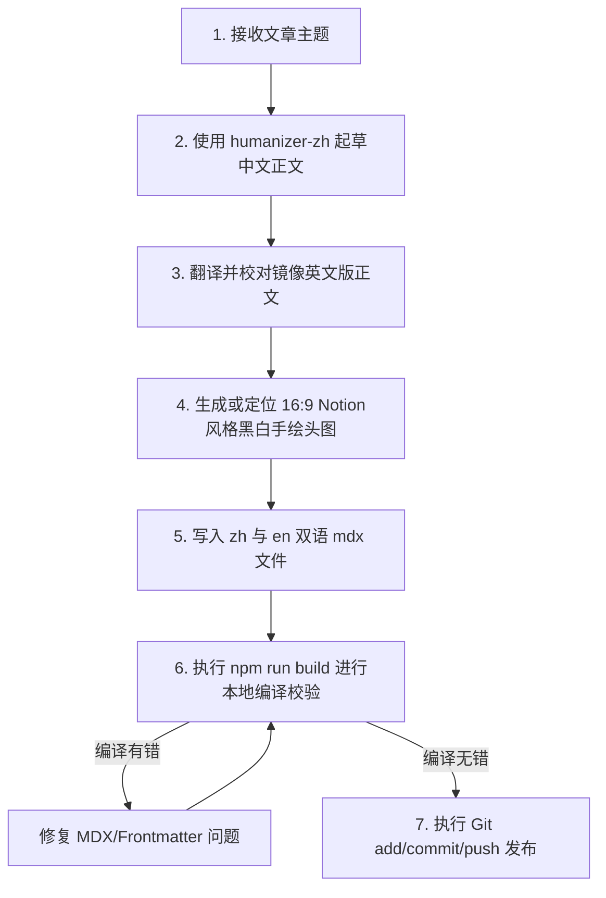

# Blog Generator: 神经多样性友好博客生成技能

本技能旨在为 ADHD（注意力缺陷多动障碍）及神经多样性受众提供一套标准化的博客生成、排版与 i18n 多语言同步流程。通过本指南，未来的 AI 助手能够深刻领会项目的“去干扰、高呼吸感、极简 Notion 风格”美学，并避开 MDX 编译与 YAML 校验等常见工程坑，实现**一次性、零报错生成**（Loop Engineering）。

---

## 1. 核心设计哲学与风格一致性

为了带给受众宁静、无压力、易消化的阅读体验，所有生成的博客必须强制符合以下排版与行文标准：

### A. 去 AI 痕迹的真诚人声 (Humanized Voice)
- **短句为主，节奏交错**：长短句结合，避免连续三个长度相同的句子或机械排比。段落开头和结尾形式要多样化。
- **杜绝空洞词汇与宏大叙事**：不使用“此外、然而、在不断演变的格局中、宝贵的织锦”等 AI 词汇；不夸大事件意义，不写假大空的总结与升华。
- **第一人称与具体细节**：使用第一人称「我们」视角与读者建立平等的同理心。用极其具体、生活化的场景（例如：堆积的纸箱、洗不完的碗、拖延回复的微信）来阐述道理，引起共鸣。

### B. 神经多样性（ADHD）友好排版
- **单头图配置（No Inline Images）**：文章正文体内**严禁**插入多余的行内配图，避免读者阅读时分心。仅在 Frontmatter 中配置一张 16:9 比例的头图（Notion 风格黑白手绘插画）。所有新文章的头图必须基于以下**官方插画 Prompt 模版**生成，以确保全站视觉一致性：
  > `Minimalist abstract hand-drawn doodle illustration in Notion style, black and white sketch, 16:9 aspect ratio. An abstract minimalist human shape or gesture as the center subject [describe action here, e.g., stretching / breaking free]. Solid black flat shapes for clothing/shadows. Tiny, highly abstract or no facial features. Pure white background with massive white space around the subject. Minimal clean outlines with slight marker texture. Surround the figure with a few tiny, highly abstract themed conceptual symbols [describe themed elements here, e.g., simple curves, battery outline, or stars] connected by delicate dotted lines. Monochrome ink only, no color, no gradients, no shading, deeply abstract and calming aesthetic.`
- **超高呼吸感留白**：
  - 段落（`p`）行高锁定为 `1.85` 倍，段落间距（`margin-top/bottom`）拓宽至 `1.6rem` 与 `1.8rem`。
  - 列表项（`li`）的纵向空白距离调大至 `0.6rem`，降低阅读的视觉密度。
- **视觉扫描锚点**：
  - 无序列表的前置圆点（`li::marker`）必须设为高对比度的品牌紫色（`var(--color-violet-dark)`），引导快速扫描。
  - 引言卡片（`blockquote`）采用微弱淡紫色背景（`rgba(167, 139, 250, 0.05)`）和圆角，作为视线缓冲港。
- **静止无干扰交互**：去除所有悬浮卡片时的物理漂移（`translateY`）和弥散紫影，避免高频操作的动效干扰。

### C. 有张有弛的阅读节奏与强度管理 (Dynamic Pacing & Intensity)
- **拒绝持续高强度输出**：无论是宣泄痛点还是讲解干货，都不要全篇使用同一种情绪张力或语言强度。持续紧绷的痛点会让人焦虑窒息，持续密集的理论会让人疲惫放弃。
- **起承转合的节奏管理**：
  - *痛点切入时*要有情感张力，快速勾起读者共鸣；
  - *干货阐述时*要客观、理智、清晰，降温读者情绪，降低认知负荷；
  - *过渡与日常调侃时*要幽默自嘲、语气放缓，为读者大脑留出喘息和自省的“缓冲地带”。
- **长短句交错**：重要结论或情感爆发使用利落短句；解释复杂逻辑使用娓娓道来的长句。

---

## 2. 闭环工程避坑指南 (Loop Engineering)

为了保障 Astro 5.x 编译和构建流水线 100% 成功，必须严格遵守以下底层语法和校验规范：

### A. Frontmatter 格式防错
1. **中文符号的单引号包裹**：如果属性值中含有中文标点符号（如 `「」`、`：`、`，`），必须在 YAML 中使用单引号 `'` 包裹整个字符串。例如：
   ```yaml
   title: '告别「我应该」，拥抱「我可以」：写给 ADHD 的生活指南'
   ```
   *直写含有中文标点而不用单引号包裹的属性值会导致 YAML 解析失败。*
2. **日期字段格式限制**：`pubDate` 在 Schema 中是 `z.coerce.date()`，必须写入符合 ISO 8601 或 `YYYY-MM-DD` 格式的字符串（例如 `"2026-06-23"`）。不能漏写双引号，否则可能被 YAML 错译为纯数字或日期对象引起类型冲突。
3. **本地图片 Schema 处理**：`heroImage` 由 Astro `image()` 助手托管解析。它在 Frontmatter 中的相对路径必须精确指向 `src/assets/blog/` 下的对应优化图，且路径要相对于该 `.mdx` 文件（例如 `../../../assets/blog/adhd-focus-can.png`）。

### B. MDX 标点加粗 Bug 规避
- 在 MDX 中，当中文字符、中文引号（如 `「`）与 Markdown 加粗符号 `**` 粘连时，编译器常会将其解析为字面量 `**` 暴露在页面上。
- **规避方案**：在中文字符和中文标点需要加粗时，**一律改用标准 HTML 的 `<strong>` 标签**，如：
  ```html
  换成<strong>「我可以……」</strong>：
  ```
  *这能彻底规避 Markdown 加粗前后的空格限制，确保渲染完全正常。*

### C. 多语言（i18n）镜像同步
- 当创建中文文章时，**必须同步在英文目录下创建相同 Slug 的英文版文章**，以支持页面的中英无缝切换：
  - 中文路径：`src/content/blog/zh/[slug].mdx`
  - 英文路径：`src/content/blog/en/[slug].mdx`
- 两个文件的 Frontmatter 键值结构必须完全镜像对齐，正文内容分别使用经过 Humanizer 润色后的地道中英文，且行内分割、排版和列表格式完全对齐。

### D. 中文去英文标注与标签本土化规范
- **标签本土化**：中文版文章的 frontmatter `tags` 必须全部使用中文词汇（ADHD, ASD, AuDHD, CBT 等医学/学术专有名词简称除外），不能直接套用英文单词标签（例如用 `'任务瘫痪'` 代替 `'Task-Paralysis'`，用 `'时间盲区'` 代替 `'Time-Blindness'`）。
- **去英文标注**：中文正文阐述专业概念时，非必要不使用英文备注（如直写 `前额叶皮层`、`执行功能障碍`，避免写成 `前额叶皮层（Prefrontal Cortex）`、`执行功能障碍（Executive Dysfunction）`）。常见的医疗简称（如 RSD, CBT）可以酌情保留。
- **简化文献与快速问答标题**：文末引用文献章节在中文版中统一命名为 `## 引用来源`，英文版统一命名为 `## References`（若有）；快速问答统一为 `## 快速问答`（中文版）与 `## Quick Q&A`（英文版）。

---

## 3. 一次性生成与发布工作流 (Once-Through Flow)

下一次需要生成新博客文章时，请按照以下闭环流程逐步执行，确保一步到位：



### 执行检查表 (Checklist)
1. [ ] **头图**：新插图是否已放入 `src/assets/blog/`，且文章体里**没有**行内配图？
2. [ ] **Frontmatter**：中英文的 title 是否正确用了单引号包裹？`pubDate` 格式是否为 `"YYYY-MM-DD"`？
3. [ ] **MDX**：文章里是否有中文标点贴合的 `**`？如果有，是否已改用 `<strong>` 标签？
4. [ ] **多语言**：`zh` 和 `en` 文件夹下的文件名（Slug）是否完全一致？
5. [ ] **本地验证**：是否成功跑通了 `npm run build`？Astro check 是否报告 0 errors？

遵守此技能，下一次生成将不再需要反复修正和打补丁，直接完美交卷！

---

## 4. 推荐的 ADHD 博客经典结构模板 (Recommended Post Structure)

为了确保博客质量和对神经多样性读者的友好度，所有新生成的文章在起草时应严格遵循以下标准化结构：

1. **Frontmatter 配置与 GEO 标题优化**：
   - 必须包含 `title`、`description`、`pubDate`、`heroImage` 和 `tags`。中英文版本的 Frontmatter 键值（Key）结构必须一致。如果标题/描述包含中文标点符号，必须用单引号 `'` 包裹。
   - **双语标题 GEO 命名规范 (非强制镜像对照)**：中英文标题的内容与命名思路**不需要镜像一致**，应针对各自语言市场与生成式引擎（GEO）的算法特征进行独立综合优化，使其更符合 AI 搜索意图。
   - **GEO 标题设计四大要素**：
     * **问答拟真 (Intent Match)**：标题应设计成能够直接回答用户常见提问 Prompt 的句式（如 `How to Relieve...` / `如何自我缓解...`），提升 LLM 语义检索匹配率。
     * **实体高密度 (Entity Density)**：嵌入高关联专有名词（如 `ADHD Paralysis` / `执行功能障碍`），提高在 AI 知识图谱中的检索比重。
     * **结构化暗示 (Structural Signpost)**：在标题中引入数字或清晰步骤（如 `3 Physical Hacks` / `3 个物理自救技巧`），使 LLM 易于提取页面作为总结源。
     * **循证可信度 (E-E-A-T)**：包含 `Science-Backed` / `科学实证` 等信任暗示，迎合 AI 搜索引擎（如 Google SGE / Copilot）对可信度页面的偏好。

2. **Quick Summary (快速摘要) 框**：
   - 在正文最开头，必须以一个淡灰色圆角边框的 `div` 结构包裹：
     ```html
     <div class="bg-zinc-50/80 border border-black/5 rounded-2xl p-6 mb-10">
       <div class="text-xs font-black text-violet-700 tracking-wider mb-2 flex items-center gap-1.5">
         <svg xmlns="http://www.w3.org/2000/svg" width="14" height="14" viewBox="0 0 24 24" fill="none" stroke="currentColor" stroke-width="2.5" stroke-linecap="round" stroke-linejoin="round" class="lucide lucide-zap"><polygon points="13 2 3 14 12 14 11 22 21 10 12 10 13 2"/></svg>
         <span>快速摘要 / Quick Summary</span>
       </div>
       <p class="text-[15px] text-zinc-600 leading-relaxed m-0 font-medium">
         ... 150 字内的极简核心摘要，帮助注意力难以集中的读者在 5 秒内抓住文章主旨 ...
       </p>
     </div>
     ```

3. **引言段落 (Introduction)**：
   - 抛弃宏大的行业大背景。直接用极其具体、高共鸣的生活痛点场景切入（例如：瘫在椅子上面对闪烁光标、屋里推积的快递箱、血糖过山车后的崩溃），迅速拉近与读者的距离。同时控制痛点渲染的强度，不要因过度沉重而导致读者产生负面焦虑和阅读回避。

4. **核心干预/科学方法模块 (Core Modules, 建议 3 个)**：
   - 提供零门槛、低认知负荷的非药物行动指南（如：拉伸、控糖饮食顺序、DAREBEE 开源视觉化运动库）。
   - 提倡**「最小可行训练（MVT）」**或极小步骤。
   - **强调强度变化与节奏感**：核心模块的论述应当有张有弛。避免整篇从头到尾以同一强度输出。在干货之间，适当穿插幽默自嘲、语气放缓的日常实例，给读者大脑降温，留出注意力缓冲期。
   - 所有中文字符、引号与 Markdown 加粗符号粘连时，**一律改用 `<strong>` 标签**以规避编译 Bug。

5. **生存基线总结 (Survival Baseline)**：
   - 肯定 ADHD 读者的精力起伏，强调当「电量归零」时，放过自己，仅用最少能量维持身体基线即可，杜绝给读者制造新的焦虑。

6. **快速问答 (Quick Q&A)**：
   - 统一使用 `## 快速问答` (中文版) 或 `## Quick Q&A` (英文版) 作为二级标题。
   - 解答读者在实际尝试该方法时可能遭遇的挫败（如“一拉伸就觉得心慌烦躁”、“怎么区分动力不足和低血糖”、“生理期前动不起来”），给出温柔、科学且极具实操性的解答。

7. **文献引用 (References)**：
   - 中文版统一使用 `## 引用来源` 作为二级标题，英文版统一使用 `## References` 作为二级标题。
