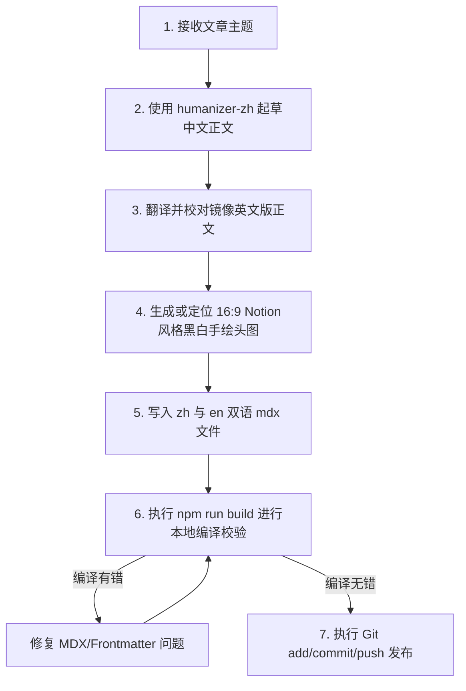

# Blog Generator: 神经多样性友好博客生成技能

本技能旨在为 ADHD（注意力缺陷多动障碍）及神经多样性受众提供一套标准化的博客生成、排版与 i18n 多语言同步流程。通过本指南，未来的 AI 助手能够深刻领会项目的“去干扰、高呼吸感、极简 Notion 风格”美学，并避开 MDX 编译与 YAML 校验等常见工程坑，实现**一次性、零报错生成**（Loop Engineering）。

---

## 1. 核心设计哲学与风格一致性

为了带给受众宁静、无压力、易消化的阅读体验，所有生成的博客必须强制符合以下排版与行文标准：

### A. 去 AI 痕迹的真诚人声 (Humanized Voice)
- **短句为主，节奏交错**：长短句结合，避免连续三个长度相同的句子或机械排比。段落开头和结尾形式要多样化。
- **杜绝空洞词汇与宏大叙事**：不使用“此外、然而、在不断演变的格局中、宝贵的织锦”等 AI 词汇；不夸大事件意义，不写假大空的总结与升华。
- **第一人称与具体细节**：使用第一人称「我们」视角与读者建立平等的同理心。用极其具体、生活化的场景（例如：堆积的纸箱、洗不完的碗、拖延回复的微信）来阐述道理，引起共鸣。

### B. 神经多样性（ADHD）友好排版
- **单头图配置（No Inline Images）**：文章正文体内**严禁**插入多余的行内配图，避免读者阅读时分心。仅在 Frontmatter 中配置一张 16:9 比例的头图（Notion 风格黑白手绘插画）。
- **超高呼吸感留白**：
  - 段落（`p`）行高锁定为 `1.85` 倍，段落间距（`margin-top/bottom`）拓宽至 `1.6rem` 与 `1.8rem`。
  - 列表项（`li`）的纵向空白距离调大至 `0.6rem`，降低阅读的视觉密度。
- **视觉扫描锚点**：
  - 无序列表的前置圆点（`li::marker`）必须设为高对比度的品牌紫色（`var(--color-violet-dark)`），引导快速扫描。
  - 引言卡片（`blockquote`）采用微弱淡紫色背景（`rgba(167, 139, 250, 0.05)`）和圆角，作为视线缓冲港。
- **静止无干扰交互**：去除所有悬浮卡片时的物理漂移（`translateY`）和弥散紫影，避免高频操作的动效干扰。

---

## 2. 闭环工程避坑指南 (Loop Engineering)

为了保障 Astro 5.x 编译和构建流水线 100% 成功，必须严格遵守以下底层语法和校验规范：

### A. Frontmatter 格式防错
1. **中文符号的单引号包裹**：如果属性值中含有中文标点符号（如 `「」`、`：`、`，`），必须在 YAML 中使用单引号 `'` 包裹整个字符串。例如：
   ```yaml
   title: '告别「我应该」，拥抱「我可以」：写给 ADHD 的生活指南'
   ```
   *直写含有中文标点而不用单引号包裹的属性值会导致 YAML 解析失败。*
2. **日期字段格式限制**：`pubDate` 在 Schema 中是 `z.coerce.date()`，必须写入符合 ISO 8601 或 `YYYY-MM-DD` 格式的字符串（例如 `"2026-06-23"`）。不能漏写双引号，否则可能被 YAML 错译为纯数字或日期对象引起类型冲突。
3. **本地图片 Schema 处理**：`heroImage` 由 Astro `image()` 助手托管解析。它在 Frontmatter 中的相对路径必须精确指向 `src/assets/blog/` 下的对应优化图，且路径要相对于该 `.mdx` 文件（例如 `../../../assets/blog/adhd-focus-can.png`）。

### B. MDX 标点加粗 Bug 规避
- 在 MDX 中，当中文字符、中文引号（如 `「`）与 Markdown 加粗符号 `**` 粘连时，编译器常会将其解析为字面量 `**` 暴露在页面上。
- **规避方案**：在中文字符和中文标点需要加粗时，**一律改用标准 HTML 的 `<strong>` 标签**，如：
  ```html
  换成<strong>「我可以……」</strong>：
  ```
  *这能彻底规避 Markdown 加粗前后的空格限制，确保渲染完全正常。*

### C. 多语言（i18n）镜像同步
- 当创建中文文章时，**必须同步在英文目录下创建相同 Slug 的英文版文章**，以支持页面的中英无缝切换：
  - 中文路径：`src/content/blog/zh/[slug].mdx`
  - 英文路径：`src/content/blog/en/[slug].mdx`
- 两个文件的 Frontmatter 键值结构必须完全镜像对齐，正文内容分别使用经过 Humanizer 润色后的地道中英文，且行内分割、排版和列表格式完全对齐。

---

## 3. 一次性生成与发布工作流 (Once-Through Flow)

下一次需要生成新博客文章时，请按照以下闭环流程逐步执行，确保一步到位：



### 执行检查表 (Checklist)
1. [ ] **头图**：新插图是否已放入 `src/assets/blog/`，且文章体里**没有**行内配图？
2. [ ] **Frontmatter**：中英文的 title 是否正确用了单引号包裹？`pubDate` 格式是否为 `"YYYY-MM-DD"`？
3. [ ] **MDX**：文章里是否有中文标点贴合的 `**`？如果有，是否已改用 `<strong>` 标签？
4. [ ] **多语言**：`zh` 和 `en` 文件夹下的文件名（Slug）是否完全一致？
5. [ ] **本地验证**：是否成功跑通了 `npm run build`？Astro check 是否报告 0 errors？

遵守此技能，下一次生成将不再需要反复修正和打补丁，直接完美交卷！
