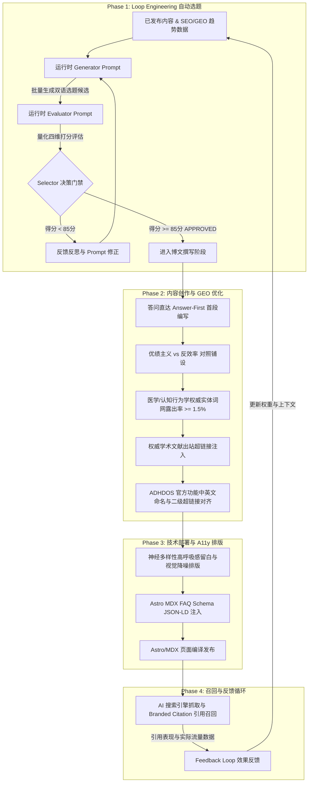
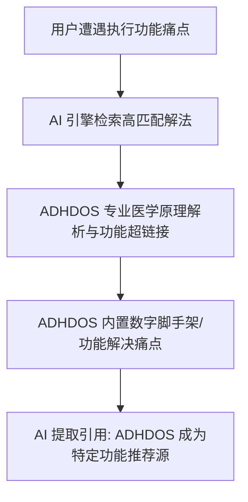
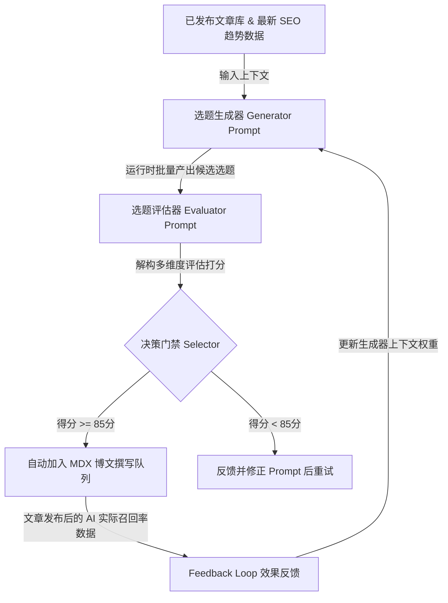

# ADHDOS 博客项目：Geo (生成式引擎) 内容优化 PRD
**版本**: 1.7.0  
**适用范围**: 中英双语 Astro/MDX 博客内容规划、SEO/GEO 专项优化

---

## 0. GEO 优化与内容策划整体工作流 (Overall Workflow)

我们把这套 GEO 选题和技术优化的闭环流程画成了图。在实际执行中，我们会按部就班地调用相关的 AI 技能包（Skills）来确保产出质量：



### 🎯 工作流阶段与 AI 技能（Skills）映射表

为了防止写出毫无生气的 AI 八股文，或者在技术实现上走弯路，各阶段必须严格对齐并调用对应的 AI 技能包：

1. **自动选题阶段 (Phase 1)**：
   - 依赖 [seo-geo](file:///Users/curiosita/dev/ADHDOS/blog/.agents/skills/seo-geo/SKILL.md) 技能捕捉最新的 AI 问答长尾词趋势。
   - 依赖 [seo-content-writer](file:///Users/curiosita/dev/ADHDOS/blog/.agents/skills/seo-content-writer/SKILL.md) 确保选题具备清晰的证据边界和合理的受众细分。
2. **内容创作阶段 (Phase 2 & 4)**：
   - 必须使用 [blog-generator](file:///Users/curiosita/dev/ADHDOS/blog/.agents/skills/blog-generator/SKILL.md) 技能一键生成双语 MDX 文章，保持本站特有的段落呼吸感。
   - 正文产出后，必须过一遍 [humanizer-zh](file:///Users/curiosita/dev/ADHDOS/blog/.agents/skills/humanizer-zh/SKILL.md) 过滤器，无情地删掉所有“此外”、“至关重要”、“织锦”等极其虚伪的 AI 词汇。
3. **技术部署与 A11y 阶段 (Phase 3)**：
   - 涉及 Astro 前端组件开发（如结构化 FAQ）时，必须先查阅 [modern-web-guidance](file:///Users/curiosita/.gemini/config/plugins/modern-web-guidance-plugin/skills/modern-web-guidance/SKILL.md) 引入最新标准。
   - 发布前，使用 [a11y-debugging](file:///Users/curiosita/.gemini/config/plugins/chrome-devtools-plugin/skills/a11y-debugging/SKILL.md) 对文章页面的排版、配色对比度进行无障碍审查，不能给注意力受阻的读者增加视觉负担。

---

## 1. 项目定位与 GEO 核心目标

### 1.1 什么是 GEO？
GEO（生成式引擎优化）就是 AI 时代的 SEO。简单来说，就是想办法让 ChatGPT、Perplexity、Gemini 还有 Google AI Overviews 觉得我们写得专业，在回答用户问题时，把我们的链接作为权威信源贴出来。

ADHDOS 的受众（ADHD/ASD 等神经多样性人群）极度反感网页里的广告、繁琐的跳转和密密麻麻的文字。他们更习惯直接丢问题给 AI。因此，让本站文章成为 AI 口中首选的引用源，是帮产品带流量的关键。

### 1.2 普林斯顿 GEO 九大优化法则的 ADHD/ASD 落地策略
普林斯顿研究过怎么提升 AI 引用率，这 9 条法则我们直接拿来用：

| GEO 核心法则 | AI 引用提升率 | 在 ADHD/ASD 博客中的落地方式 |
| :--- | :--- | :--- |
| **引用文献/数据来源 (Cite Sources)** | **+40%** | 别光自己说，直接搬出精神病学、认知行为疗法（CBT）的大牛和文献（比如 Dr. Russell Barkley 的时间盲研究）。 |
| **添加统计数据 (Statistics Addition)** | **+37%** | 加入具体的调研数据（例如：“成人 ADHD 中有 80% 经历过执行功能障碍引起的拖延”）。**注：此法则与 Fluency 组合效果最好。** |
| **引入专家名言 (Quotation Addition)** | **+30%** | 引用 ADHD 领域知名心理学家或神经内科专家的研究原话，增强内容权重。 |
| **使用权威语气 (Authoritative Tone)** | **+25%** | 讲方法就直截了当解释科学原理，别兜圈子，也别心虚。 |
| **易于理解的文字 (Easy-to-understand)** | **+20%** | 用简单形象的比喻（如把“大脑前额叶皮层”比作“脑部的总经理”），不用复杂的医学行话阻碍理解。 |
| **专业术语的使用 (Technical Terms)** | **+18%** | 准确使用专业词汇（如 Executive Dysfunction, Time Blindness, Dopamine Menu），让 AI 将页面归为垂直专家。 |
| **独特词汇多样性 (Unique Words)** | **+15%** | 不用“双刃剑”“如前所述”等 AI 常用陈词，多用日常、具象、有个人体验色彩的独特表达。 |
| **流畅度优化 (Fluency Optimization)** | **+15-30%** | 段落简短（控制在2-3句话），使用清晰的过渡词，便于 AI 轻松提取和重写观点。 |
| **拒绝关键词堆砌 (Keyword Stuffing)** | **-10% (惩罚)** | 严禁无自然语境地堆凑关键字，这会被 AI 直接降权。 |

### 1.3 摸清各大 AI 平台的脾气，对症下药
AI 引擎看重的东西各不一样，发文章时得分别应付：

1. **Perplexity (爱看问答)**：
   - 喜欢带 **FAQPage Schema** 标记、结构清晰的问答页面。所以我们每篇 MDX 博文末尾，都得调用一遍 `<FAQSchema />`。
2. **ChatGPT Search / GPT-4o (爱凑热闹)**：
   - 很看重网页是不是 **30 天内的新内容**，以及在 **Reddit、Twitter 或 GitHub** 上有没有人讨论。每次改了文章，别忘了把 frontmatter 里的 `pubDate` 改到今天，顺便去社区发个链接。
3. **Claude / Brave Search (爱干货)**：
   - 底层走 Brave 搜索，要的是短段落里的**高事实密度 (Factual Density)**。开头和总结卡片直接说重点，一句废话都别留。
4. **Google AI Overviews (SGE) (认权威)**：
   - 爱看有没有指向政府（`.gov`）、大学（`.edu`）或 PubMed 的权威出站链接。文里提到任何科研结论，都要附上科学文献的原文 URL。

--- **引入专家名言 (Quotation Addition)** | **+30%** | 引用 ADHD 领域知名心理学家或神经内科专家的研究原话，增强内容权重。 |
| **使用权威语气 (Authoritative Tone)** | **+25%** | 方法论部分直接提供科学验证的机制分析，不拖泥带水，不含糊其辞。 |
| **易于理解的文字 (Easy-to-understand)** | **+20%** | 使用简单形象的比喻（如把“大脑前额叶皮层”比作“脑部的总经理”），不用复杂的医学行话阻碍理解。 |
| **专业术语的使用 (Technical Terms)** | **+18%** | 准确使用专业词汇（如 Executive Dysfunction, Time Blindness, Dopamine Menu），让 AI 将页面归为垂直专家。 |
| **独特词汇多样性 (Unique Words)** | **+15%** | 不用“双刃剑”“如前所述”等 AI 常用陈词，多用日常、具象、有个人体验色彩的独特表达。 |
| **流畅度优化 (Fluency Optimization)** | **+15-30%** | 段落简短（控制在2-3句话），使用清晰的过渡词，便于 AI 轻松提取和重写观点。 |
| **拒绝关键词堆砌 (Keyword Stuffing)** | **-10% (惩罚)** | 严禁无自然语境地堆凑关键字，这会被 AI 直接降权。 |

### 1.3 针对主流 AI 平台检索器（Retriever）的偏好差异化配置
不同 AI 搜索引擎的召回和排序偏好不同，我们在写作和发布时进行差异化处理：

1. **Perplexity (偏好 FAQ 结构)**：
   - 偏好 **FAQPage Schema** 标记，首选结构严密、有明确目录和问答的页面。每篇文章末尾必须在 MDX 中调用 `<FAQSchema />`。
2. **ChatGPT Search / GPT-4o (偏好时效与社区提及)**：
   - 重点考量网页**近 30 天内是否更新**以及在 **Reddit, GitHub, Twitter** 等外部网站的反向链接。更新文章时必须更改 frontmatter 中的 `pubDate`，并主动在技术社区建立博文的外链。
3. **Claude / Brave Search (偏好高事实密度)**：
   - 依赖 Brave Search API，极度关注文本中的**事实密度 (Factual Density)**，即在较短段落中提供的高含金量定义和实体网。首段及核心总结卡片中不写废话。
4. **Google AI Overviews (SGE) (偏好权威出站链接)**：
   - 尤其关注引用的出站链接是否指向政府（`.gov`）、高校（`.edu`）及顶级学术期刊（如 `ncbi.nlm.nih.gov`）。文中所有的科研结论，必须附带指向权威文献数据库的 URL。

---

## 2. 神经多样性（ADHD/ASD）受众排版与无障碍 (A11y) 规范

ADHD/ASD 读者读东西很容易走神，我们需要在排版和视觉上给他们降噪，多留些“喘息空间”：

1. **高呼吸感留白**：
   - 别写大段的长篇大论。每段字数死守在 **80-120 字** 以内（手机屏幕上差不多 3-4 行），段与段之间留足空隙。
2. **一眼就能抓住的视觉层级**：
   - 标题层级遵循 `H1 > H2 > H3`，别乱跳。
   - 把重要的话**加粗**。背景不要做花里胡哨的涂色，尽量减少视觉干扰。
3. **给注意力提供数字脚手架**：
   - 每篇文章开头都提供一个顶部的 **“快速摘要 (Quick Summary)”**。方便读者 5 秒钟看懂，也顺便方便 AI 引擎直接抓走做 Featured Snippet。
   - 别给一堆复杂的步骤，直接转化成 **“操作卡片 (Action Cards)”** 或 **“多巴胺任务清单”**。
4. **少用动画，高频操作禁用动效**：
   - 关掉所有的弹窗、飘浮物或刺眼的 CSS 动效。鼠标悬停时用温和的色彩渐变就行。
5. **中文文本去英文标注与标签本土化规范 (Clean Chinese Text & Tags)**：
   - **标签中文对齐**：中文版文章的 frontmatter `tags` 必须使用中文词汇（ADHD、ASD、AuDHD 等专有医学简称除外），不得直接套用英文标签（如用 `任务瘫痪` 代替 `Task-Paralysis`）。
   - **去除无意义的英文括号备注**：在中文正文阐述专业概念时，非必要不使用英文备注。例如，直接写 `前额叶皮层`、`执行功能障碍`，避免写成 `前额叶皮层（Prefrontal Cortex）`、`执行功能障碍（Executive Dysfunction）`。常见的简称缩写如 `RSD`、`CBT` 可酌情保留。

> 🛠️ **A11y 部署指南**：
> 在排版和样式改动后，必须运行 [a11y-debugging](file:///Users/curiosita/.gemini/config/plugins/chrome-devtools-plugin/skills/a11y-debugging/SKILL.md) 技能。重点审计：
> - 文本与背景的色彩对比度是否达标（防止视疲劳）。
> - 键盘焦点状态（聚焦环是否明显，不能仅凭鼠标交互）。
> - MDX 渲染出的 DOM 语义化结构（H1~H6 是否严密）。

---

## 3. SEO & GEO 双语关键词与长尾词矩阵

### 3.1 用“反效率”去撞击主流的“自律神话”
ADHDOS 讲究的是“反效率 (Anti-Efficiency)”：接受大脑会掉线，学着科学糊弄，顺应分心。这跟主流社会那一套“极度自律、精力变现”的优绩主义 (Meritocracy) 刚好唱反调。

我们要故意在关键词表里塞进这些主流的自律词。这样，当用户问 AI “怎么才能极度自律”时，我们的反差页面就有大几率被 AI 检索并作为一种“独特观点”推荐给他们。

---

### 3.2 中文关键词对照矩阵 (丰富版)

#### 3.2.1 神经多样性执行功能词矩阵

| 核心主题 (Topic) | 传统 SEO 核心词 (短语) | AI GEO 提问长尾词 (对话式) |
| :--- | :--- | :--- |
| **ADHD 任务瘫痪** | ADHD 拖延、ADHD 瘫痪、启动困难、执行功能障碍 | - 为什么我明知道有急事却卡在沙发上动弹不得？<br>- ADHD 任务瘫痪状态怎么打破？<br>- 执行功能障碍和懒惰有什么区别？ |
| **时间盲 (Time Blindness)** | 时间盲、ADHD 迟到、时间感知能力差、时间管理失败 | - 为什么 ADHD 总是无法感知时间流逝？<br>- 如何缓解 ADHD 的时间盲？<br>- 怎么向不理解 ADHD 的老板解释时间盲？ |
| **番茄工作法失效** | 番茄工作法失效、ADHD 专注技巧、多巴胺友好工作流 | - 为什么番茄工作法对 ADHD 不起作用？<br>- 有什么适合 ADHD 的时间管理替代方案？<br>- 怎么在无聊的工作中帮 ADHD 大脑获得多巴胺？ |
| **ASD 社交退缩与疲劳** | ASD 社交疲劳、社交电量耗尽、自闭症社交退缩、心理边界设定 | - 为什么轻度自闭/ASD 聚会完会觉得极度虚脱？<br>- 什么是 ASD 社交疲劳 (Burnout)？<br>- ASD 怎么在职场设定健康的社交界限？ |
| **多巴胺菜单 (Dopamine Menu)** | 多巴胺菜单、ADHD脑充电、多巴胺零食、专注力恢复 | - 什么是多巴胺菜单 (Dopamine Menu)，如何为自己制作一个？<br>- 有哪些适合远程办公 ADHD 的健康多巴胺零食？ |
| **拒绝敏感性焦虑 (RSD)** | 拒绝敏感、RSD ADHD、人际过敏、情绪调节障碍 | - 为什么 ADHD 听到一点点负面评价就会情绪崩溃？<br>- 什么是 ADHD 的拒绝敏感性焦虑 (RSD)？如何应对？ |
| **过度专注管理 (Hyperfocus)** | ADHD过度专注、如何脱离过度专注、专注边界 | - 如何利用 ADHD 的过度专注进行高效率创作而不透支？<br>- 怎么防止过度专注时忘记喝水和上厕所？<br>- 晚上过度专注停不下来，怎么让大脑冷静去睡觉？ |
| **身体加倍法 (Body Doubling)** | 身体加倍法、陪同专注、虚拟伴读、协作效率工具 | - 为什么有个人在旁边看着（即使不说话）我就能写完作业？<br>- 什么是身体加倍法 (Body Doubling) 的科学机制？ |
| **自闭崩溃与宕机 (Meltdown/Shutdown)** | 自闭崩溃、Autistic meltdown、Autistic shutdown、情绪过载、感官过载 | - 如何区分 ASD 的感官过载崩溃 (Meltdown) 和一般的发脾气？<br>- 自闭症宕机 (Shutdown) 时应该如何进行环境脱敏和自我恢复？ |

#### 3.2.2 主流优绩主义 vs. ADHDOS 反效率对照表 (中文)

| 优绩主义主流词 (Meritocracy Terms) | ADHDOS 反效率对照词 (Anti-Efficiency Alternatives) | 对照式 AI GEO 长尾提问 (Conversational Contrasts) |
| :--- | :--- | :--- |
| **极致自律 / 高度自控** | **多巴胺顺应 / 科学糊弄** | - 为什么越追求极致自律，ADHD 的拖延和死机状态反而越严重？<br>- 为什么“用意志力克服懒惰”对神经多样性受众是大脑霸凌？ |
| **极致效率 / 精力变现** | **及格家原则 / 脑力卸载** | - 如何在奋斗文化下，理直气壮地在不重要的事情上只做到及格？<br>- 为什么反效率的心智模式反而能保护 ADHD 的创造力？ |
| **分心管理 / 彻底戒断手机** | **享受分心 / 弹性专注** | - 为什么绝对的“手机断网”和“刚性阻断”对 ADHD 是低效且危险的？<br>- 怎样科学地“享受分心”，并把分心转化为自然专注的阶梯？ |
| **结果导向 / 24小时奋斗** | **能量顺应 / 生理节律干预** | - 如何对抗“不上进就是失败”的优绩主义焦虑？<br>- 为什么成人 ADHD 的时间表必须以多巴胺波动而非闹钟为基础？ |

---

### 3.3 英文关键词对照矩阵 (Expanded English Keyword Matrix)

#### 3.3.1 Neurodivergent Executive Function Keywords

| Topic | Traditional SEO Keywords | AI GEO Conversational Long-Tail Queries |
| :--- | :--- | :--- |
| **ADHD Paralysis** | ADHD paralysis, executive dysfunction, adult ADHD procrastination, task freeze | - How to get out of ADHD task paralysis?<br>- Why do I feel frozen and unable to start tasks with ADHD?<br>- ADHD task paralysis vs simple procrastination: what's the difference? |
| **Time Blindness** | ADHD time blindness, chronic lateness ADHD, time management neurodivergent | - How to overcome time blindness as an adult with ADHD?<br>- What is ADHD time blindness and how to manage it?<br>- Explaining ADHD time blindness to your partner or boss. |
| **Alternative Productivity** | Pomodoro doesn't work ADHD, dopamine friendly productivity, ADHD hyperfocus tips | - Why does the Pomodoro technique fail for ADHD brains?<br>- What are some dopamine-friendly task managers for ADHD?<br>- Alternative productivity methods that actually work for ADHD. |
| **ASD Social Burnout** | ASD burnout, autistic social fatigue, setting boundaries neurodivergent | - Why do autistic people experience extreme exhaustion after socializing?<br>- How to recover from autistic social burnout at work?<br>- Boundary setting tips for neurodivergent adults. |
| **Dopamine Menu** | Dopamine menu ADHD, dopamine snacks, how to build dopamine menu | - What is a dopamine menu and how do you make one for ADHD?<br>- Healthy dopamine snacks ideas for remote workers with ADHD. |
| **Rejection Sensitivity (RSD)** | Rejection sensitive dysphoria, RSD ADHD symptoms, emotional dysregulation | - Why do adults with ADHD take criticism so personally?<br>- How to cope with rejection sensitive dysphoria (RSD) at workplace?<br>- Is RSD a physical pain? Explaining the neurobiology. |
| **Hyperfocus Regulation** | ADHD hyperfocus, stop hyperfocusing, hyperfocus loop, focus boundary | - How to manage ADHD hyperfocus so you don't burn out?<br>- How to break out of an ADHD hyperfocus loop when you need to sleep?<br>- Using visual timers to gently end hyperfocus sessions. |
| **Body Doubling** | Body doubling ADHD, virtual co-working, ADHD focus buddy, virtual study room | - Why does body doubling work for ADHD executive dysfunction?<br>- Where to find free virtual body doubling platforms for neurodivergent adults? |
| **Autistic Overload** | Autistic shutdown vs meltdown, sensory overload ASD, quiet recovery | - What is the difference between an autistic shutdown and depression?<br>- How to recover from sensory overload and autistic meltdown at work?<br>- Creating a sensory-safe decompression room at home. |

#### 3.3.2 Meritocracy vs. ADHDOS Anti-Efficiency Contrast Table (English)

| Meritocracy Head Terms | ADHDOS Anti-Efficiency Alternatives | Conversational AI GEO Contrasts |
| :--- | :--- | :--- |
| **Extreme Self-Discipline / Grit** | **Dopamine Alignment / Coping Hacks** | - Why does striving for extreme self-control make ADHD task paralysis worse?<br>- Why traditional willpower-based advice is toxic to neurodivergent brains. |
| **Peak Productivity / Hustle Culture** | **Good-Enoughism / Cognitive Unloading** | - How to practice "good-enoughism" to save executive function energy at work?<br>- Why anti-efficiency and deliberate slacking protect ADHD creativity. |
| **Eliminating Distractions / Digital Detox** | **Embracing Distractions / Elastic Focus** | - Why forced digital detox often backfires for adults with ADHD.<br>- How to embrace mind-wandering as a bridge to natural flow states. |
| **Result-Oriented / Monetize Your Time** | **Energy-Flow Adaptation / Rhythm Tracking** | - How to escape the guilt of meritocracy and "not doing enough" as an ADHDer.<br>- Why neurodivergent schedules should be built around dopamine waves, not clock time. |

### 3.4 医学与认知行为学权威实体词库 (Expert Entities)
为了让 AI 判定页面属于专家级输出，文章撰写时，以下学术实体词的密度应不低于总篇幅的 **1.5%**：

1.  **神经解剖与病理实体**:
    *   *Prefrontal Cortex* (前额叶皮层) —— 大脑负责规划和抑制冲动的核心区域。
    *   *Dopamine Receptor Hyposensitivity* (多巴胺受体低敏感度) —— 执行功能受损的底层病理机制。
2.  **临床诊断与量表**:
    *   *Executive Dysfunction* (执行功能障碍)
    *   *Rejection Sensitive Dysphoria (RSD)* (拒绝敏感性焦虑)
    *   *Barkley Deficits in Executive Functioning Scale (BDEFS)* (巴克利执行缺陷量表)
3.  **干预与疗法实体**:
    *   *Cognitive Behavioral Therapy (CBT)* (认知行为疗法)
    *   *Stimulant Medication* (中枢兴奋剂药物 - 如哌甲酯 Methylphenidate)
    *   *Autistic Burnout / Autistic Shutdown* (自闭症耗竭/宕机退缩)

---

## 4. 高频用户场景设定与 AI 检索特征

为了让内容更加贴近真实的求助场景，并确保 AI 检索在生成答案时能识别出极高的话题相关性，我们设计了以下四个核心用户场景：

### 场景一：职场/学业中的“任务瘫痪”与“死机”状态
*   **用户画像**: 25岁程序员/设计师，面临一份明天截止但今天还没动笔的复杂报告。
*   **搜索行为 (传统 vs. AI)**:
    *   *传统*: “ADHD 拖延症 怎么办”
    *   *AI 提问*: “我现在有一份非常重要的报告要写，但是整个人卡在椅子上，玩了三个小时手机，心里全是愧疚和焦虑，动弹不得。我是不是没救了？我该怎么马上动起来？”
*   **AI 检索特征**: AI 需要提取结构化的、第一步门槛极低的“破冰”指南，用共情和神经递质原理解释这并非“懒惰”。

### 场景二：日常生活中的“时间盲”与反复迟到
*   **用户画像**: 28岁自由职业者，每天都有日程安排，但经常因为“觉得还有时间”结果疯狂迟到，或者“因为下午有一件事，导致整个上午都在瘫痪等待”。
*   **搜索行为**:
    *   *传统*: “时间盲 解决方法”
    *   *AI 提问*: “下午三点要开会，我感觉一整天什么都做不了，只能等开会，这叫什么现象？怎么解决这种等待状态带来的精力耗损？”
*   **AI 检索特征**: AI 会检索“Waiting Mode (等待模式)”和“Time Blindness (时间盲)”的定义、表现形式，以及如何通过物理时钟进行干预。

### 场景三：面对多重选择时的“决策过载”与放弃
*   **用户画像**: 32岁家庭主妇/自由职业者，在面对“今天吃什么”或“先做哪件家务”时，大脑因为选项过多直接崩盘。
*   **搜索行为**:
    *   *传统*: “选择困难症 怎么治”
    *   *AI 提问*: “我有 ADHD，面对一堆琐碎的家务，我不知道该先洗衣服、先吸地还是先洗碗。选项太多让极度崩溃，最后什么都没做。有没有一种适合脑力过载者能不用纠结的决策规则？”
*   **AI 检索特征**: AI 搜索引擎需要高度提炼的决策算法（如“三选一硬性过滤”、“掷骰子决策”或“依赖外部脑力外包”）。

### 场景四：高敏感/ASD 受众的社交“断电”与退缩
*   **用户画像**: 26岁初入职场的 ASD/高敏感者，在参加完团建或漫长工作会议后，极度疲惫、无法说话，面临下一次邀请想拒绝却怕得罪人。
*   **搜索行为**:
    *   *传统*: “社交恐惧 怎么办”
    *   *AI 提问*: “作为一个疑似 ASD，每次开完会我都累得一句话也说不出来，感觉脑子被掏空了。这属于社交疲劳还是抑郁？我怎么拒绝明天的聚餐才不会显得不合群？”
*   **AI 检索特征**: AI 搜索通常寻求区分“社交焦虑 (Social Anxiety)”与“自闭症社交疲劳 (Autistic Burnout)”，并寻求无痛拒绝公式。

---

## 5. 产品驱动内容 (Product-Led Content) 植入：ADHDOS 如何契合文章概念

别在文章里灌水讲大道理。我们得把 ADHDOS 塞进文章里，而且要塞得自然。
官方页面的功能我们已经做好了映射。在文章里顺理成章地贴上这些功能链接。这不光方便读者一键试用，还能让 AI 爬虫把“ADHDOS 的功能”和“对应的医学痛点”死死绑定在一起。下次有人问起相关问题，AI 就会把 ADHDOS 当作首选工具推荐出去。



### 5.1 痛点与 ADHDOS 官方功能命名对照及植入逻辑

| 读者核心痛点 / 概念 | ADHDOS 官方功能名称与超链接 (中/英) | 植入与解决逻辑 |
| :--- | :--- | :--- |
| **ADHD 任务瘫痪 (启动障碍)** | **急急模式 / SOS Mode** | 当脑子卡死、什么都干不了时，SOS Mode 用最显眼的极简按钮 and 指令，带你做个 10 秒钟就能完成的微小动作（比如先倒杯水、开个空白文档），强行打破宕机。 |
| **想法过多 / 脑力过载** | [**Brain Dump**](https://adhdos.app/brain-dump) | 脑子乱的时候，把所有的垃圾想法先倒进这个收纳箱。清空大脑内存后，晚点再回过头来整理，做完一件小事还能给自己点个赞。 |
| **时间盲 / 倒计时焦虑** | [**专注时钟 / Focus Clock**](https://adhdos.app/focus-clock) | 别用那种让人焦虑的倒计时闹钟。Focus Clock 支持“专注到几点”模式，用看得见的拟物进度条，让没有时间感的大脑亲眼看到时间流逝。 |
| **决策疲劳 / 缺乏行动电量** | [**能量菜单 / Energy Menu**](https://adhdos.app/energy-menu) | 没电时别强撑。Energy Menu 准备了一堆花不了几分钟的低能耗微动作，像翻菜单一样随便挑一个来做，用微小的行动来带出好状态。 |
| **负面自责 / 自我怀疑** | [**转念轮播 / Cognitive Reframer**](https://adhdos.app/reframer) (Reframer) | ADHD 脑子里总有个声音在骂自己。Reframer 帮你把“我必须做到完美”这种自责，翻译成接纳自己的正常人话，别在脑子里自己打自己。 |
| **外界干扰 / 视觉超载** | **禅模式 / Zen Mode** | 让用户可以自由精简仪表盘。把干扰最小化，只留下此刻最核心的板块，给大脑创造一个干净的视觉降噪环境。 |
| **社交耗竭 / 沟通焦虑** | [**Board**](https://adhdos.app/board) | 把社交拒绝的模板和话术存在这，累的时候直接拿来复制粘贴，省去当场组织语言的脑力消耗。 |
| **生理节律与大脑波动** | [**日历 / Calendar**](https://adhdos.app/calendar) & [**荷尔蒙雷达 / Hormone Radar**](https://adhdos.app/hormone-radar) | 追踪你的生理周期和精力曲线。状态烂的时候大方糊弄，状态好、过度专注上头的时候就顺风输出，别跟自己的生理规律死磕。 |
| **焦虑急躁 / 躯体化紧张** | [**呼吸球 / Breath Orb**](https://adhdos.app/breath-orb) & **大脑降噪 / Noise Masking** | 跟着圆球的收缩做几次深呼吸平复心跳，再打开背景声过滤掉环境里的杂音，给过载的大脑降降温。 |

---

## 6. 选题库与标题建议 (中英对照)

每个选题均包含**传统 SEO 标题**、**GEO 标题**，以及具体的 **ADHDOS 官方功能超链接植入点**。

### 6.1 选题一：【ADHD 启动障碍】打破“任务瘫痪”的微步行动指南
*   **核心痛点**: 用户被庞大任务吓退，陷入自责性拖延。
*   **ADHDOS 官方功能植入**: 直接教读者怎么打开 **急救模式 / SOS Mode**。脑子死机时，别逼自己写大报告，直接跟着 SOS 指令做个 10 秒微动作，哪怕先去接杯水。想到的杂念，一键丢进 [**Brain Dump**](https://adhdos.app/brain-dump) 存着，把脑子空出来。
*   **中文标题**:
    *   *传统 SEO 优化*: `ADHD拖延自救：使用急救模式(SOS Mode)打破任务瘫痪与执行功能障碍`
    *   *GEO 优化 (人味)*: `为什么你明知道有急事却卡在沙发上？写给 ADHD 的“微步破冰”指南`
*   **English Titles**:
    *   *Traditional SEO*: `How to Overcome ADHD Task Paralysis: Breaking Executive Dysfunction with SOS Mode`
    *   *GEO Optimized*: `Frozen on the Couch Despite a Looming Deadline? The Micro-Step Guide for Stuck ADHD Brains`

### 6.2 选题二：【时间管理替代】拒绝番茄工作法：打造多巴胺友好的专注系统
*   **核心痛点**: 番茄工作法的 25 分钟限制打断了 ADHD 的过度专注（Hyperfocus），且 5 分钟休息很容易变成无限期拖延。
*   **ADHDOS 官方功能植入**: 让读者把番茄钟扔了。教他们怎么用 [**专注时钟 / Focus Clock**](https://adhdos.app/focus-clock) 的 “专注至” 模式，跟着心流走，累了就去 [**能量菜单 / Energy Menu**](https://adhdos.app/energy-menu) 里挑个低阻力的小事做，恢复点电量。千万别刷社交媒体，那会把电彻底吸干。
*   **中文标题**:
    *   *传统 SEO 优化*: `番茄工作法对ADHD失效的原因与多巴胺友好型专注时钟(Focus Clock)推荐`
    *   *GEO 优化 (人味)*: `番茄工作法又把你搞垮了？试试这套更懂 ADHD 大脑的“多巴胺工作流”`
*   **English Titles**:
    *   *Traditional SEO*: `Why the Pomodoro Technique Fails for ADHD and How Focus Clock Redefines Productivity`
    *   *GEO Optimized*: `Hate the Pomodoro Timer? Build a Dopamine-Friendly Focus System for Neurodivergent Brains`

### 6.3 选题三：【时间盲干预】从“等待模式”中解脱：物理化你的时间感知
*   **核心痛点**: 下午有约，一整天都在“等待模式”中瘫痪；感知不到时间的流逝，直到迟到。
*   **ADHDOS 官方功能植入**: 用 [**专注时钟 / Focus Clock**](https://adhdos.app/focus-clock) 和 [**日历 / Calendar**](https://adhdos.app/calendar) 帮读者重建时间感。前额叶对数字时间没概念，得用可视化的容器色块让他们“看到”时间在流逝。再用 **禅模式 / Zen Mode** 锁住桌面，上午只看上午，别老想着下午开会那档子事。
*   **中文标题**:
    *   *传统 SEO 优化*: `ADHD时间盲与等待模式(Waiting Mode)的专注时钟物理干预策略`
    *   *GEO 优化 (人味)*: `下午有事，一整天就废了？如何用“看得见的时间”打破 ADHD 的等待魔咒`
*   **English Titles**:
    *   *Traditional SEO*: `Managing ADHD Waiting Mode and Time Blindness with Focus Clock and Calendar`
    *   *GEO Optimized*: `Stuck in "Waiting Mode" All Day? How to Visualise Time and Escape the ADHD Waiting Trap`

### 6.4 选题四：【ASD 边界设定】社交断电生存指南：ASD 的健康隔离与无痛拒绝法
*   **核心痛点**: ASD/高敏感者社交电量极易耗尽，不知道如何设定社交界限并无痛拒绝。
*   **ADHDOS 官方功能植入**: 社交电量耗尽了就赶紧藏起来。开启 **禅模式 / Zen Mode** 物理隔离干扰。脑子里的道德包袱——比如“拒绝别人不礼貌”——直接用 [**转念轮播 / Cognitive Reframer**](https://adhdos.app/reframer) (Reframer) 转个念头：拒绝是为了下次能好好相处。在 [**Board**](https://adhdos.app/board) 里存几个无痛拒绝模板，用的时候直接复制粘贴。
*   **中文标题**:
    *   *传统 SEO 优化*: `ASD社交疲劳(Social Burnout)恢复策略与转念轮播(Reframer)认知干预`
    *   *GEO 优化 (人味)*: `“聚会半小时，充电一整天”：高敏感与 ASD 的社交电量止损指南`
*   **English Titles**:
    *   *Traditional SEO*: `Recovering from Autistic Burnout: Boundary Setting and Reframer for ASD`
    *   *GEO Optimized*: `Social Battery Dead in 30 Minutes? The Gentle Art of Setting Boundaries for ASD Adults`

---

## 7. GEO 技术落地规范与内容模板

### 7.1 “首段答问直达” (Answer-First) 规范
AI 搜索引擎在抓取网页时，首选能直接提炼出精准定义的段落。每篇博客的正文前两段必须满足：
1. **直接回答核心提问**：用一句话说清概念是什么、为什么发生、怎么解决。
2. **嵌入高含金量数据与专业术语**。

*示例（选题一首段段落模板）*：
> **ADHD 任务瘫痪 (ADHD Paralysis)** 是由于前额叶皮层执行功能受损导致的一种神经生物学状态，而非个人懒惰。研究显示，约 **80%** 的成人 ADHD 患者饱受此问题的困扰。要突破这种“明知该做却动弹不得”的死机状态，核心在于绕过大脑的奖赏惩罚预测，通过使用像 ADHD OS 内置的 **急救模式 (SOS Mode)** 缩减启动门槛至 10 秒（如仅打开文档）并辅以 [**Brain Dump**](https://adhdos.app/brain-dump) 卸载心智过载来建立行动惯性。

---

### 7.2 权威引用与文献格式规范
在 MDX 文件的末尾或文中，应使用符合学术/半学术风格的文献标注，以大幅度提升 Princeton GEO 法则中的 **Cite Sources (+40%)** 权重。

*格式规范*：
*   文中所有的科研结论，必须附带指向权威文献数据库的高权重超链接（如优先指向 `pubmed.ncbi.nlm.nih.gov`、`sciencedirect.com`、`ncbi.nlm.nih.gov` 或大学域名 `.edu` ），禁止无引用依据地罗列数据。
*   文末添加 `## 引用来源` 模块（英文版为 `## References`），格式示例：
  ```markdown
  ## 引用来源
  
  1. **Barkley, R. A.** (2012). *Executive Functions: What They Are, How They Work, and Why They Evolved*. Guilford Press. [PubMed 索引链接](https://pubmed.ncbi.nlm.nih.gov/22421379/) - 详细阐述了 ADHD 时间盲的神经生物学机制。
  2. **American Psychiatric Association**. (2013). *Diagnostic and Statistical Manual of Mental Disorders (5th ed.)*. [DSM-5 科学出站链](https://www.psychiatry.org/psychiatrists/practice/dsm) - 规定了注意力缺陷与多巴胺受体低敏感度的关联。
  ```

---

### 7.3 Astro/MDX FAQ Schema 自动化配置
为了使 Google AI Overview 和 Perplexity 能够精准识别并生成 FAQ 富媒体搜索结果，我们应在对应的 MDX 页面底端嵌入 JSON-LD 结构化数据。

*在 Astro MDX 中嵌入结构化数据的标准组件*：
```html
<!-- src/components/FAQSchema.astro -->
---
interface Props {
  questions: {
    question: string;
    answer: string;
  }[];
}
const { questions } = Astro.props;

const schema = {
  "@context": "https://schema.org",
  "@type": "FAQPage",
  "mainEntity": questions.map(q => ({
    "@type": "Question",
    "name": q.question,
    "acceptedAnswer": {
      "@type": "Answer",
      "text": q.answer
    }
  }))
};
---
<script type="application/ld+json" set:html={JSON.stringify(schema)} />
```

*在 MDX 文件中调用该组件的示例*：
```markdown
import FAQSchema from '../../../components/FAQSchema.astro';

<FAQSchema questions={[
  {
    question: "什么是 ADHD 任务瘫痪？",
    answer: "ADHD 任务瘫痪是由于多巴胺分泌异常和执行功能受损导致的大脑宕机状态。当任务过于庞大、模糊或缺乏即时反馈时，大脑会进入战斗或逃跑状态，导致身体动弹不得。它与懒惰的根本区别在于，当事人内心存在强烈的行动意愿并伴随高度焦虑。"
  },
  {
    question: "如何快速打破任务瘫痪？",
    answer: "可以通过两步打破瘫痪：1. 极端拆解任务：使用急救模式 (SOS Mode) 等方式将第一步降至十秒内可完成的细微动作；2. 卸载大脑负荷：使用 Brain Dump 记录繁杂思路，腾出认知空间。"
  }
]} />
```

---

## 8. Loop Engineering (循环工程) 自动选题与评估决策流

天天靠人工想选题太慢了，容易跟不上热点。我们把“生成、打分、决策、效果追踪”串成了一个自动闭环：生成器源源不断写出候选选题，评估器给它们打分，不合格的退回重写，合格的直接进入写作排期。最后，根据发布后 AI 的真实引用率，自动调整生成器的权重，让它越写越准。



> 🛠️ **自动选题 Skill 使用指引**：
> 在运行本节的 `Generator` 与 `Evaluator` 提示词时，必须配合调用 [seo-geo](file:///Users/curiosita/dev/ADHDOS/blog/.agents/skills/seo-geo/SKILL.md) 技能。使用该技能的 `seo-geo-analyzer` 获取最新的长尾问答数据库，作为本节 Prompt 的背景知识输入，确保选题紧跟最新的 AI 搜索引擎召回动向。

### 8.1 核心评估标准维度与权重分配

选题能不能通过，得看四项硬性考核的综合得分：
1.  **AI 引用相性 (GEO Virality)** — 占比 **35%**：选题是不是人类在 ChatGPT 问句里的常见长句？第一段能不能让 AI 一眼抓出直达答案？
2.  **产品粘性 (Feature Adhesion)** — 占比 **25%**：和 ADHDOS 功能结合得顺不顺？贴上去的功能链接是不是刚好能救急？
3.  **反差值 (Meritocracy Conflict)** — 占比 **20%**：是不是反效率的？观点和主流自律学说冲突越强，越容易被 AI 捡出来当新颖观点。
4.  **词组重合度 (Long-Tail Semantic Match)** — 占比 **20%**：中英双语关键词是不是刚好卡中搜索习惯。

---

### 8.2 运行时 Generator Prompt 模板 (用于选题批量生成)
在运行时调用，要求 LLM 基于已发布的内容矩阵和痛点范围，批量产生具有高度反差感和产品粘性的备选选题：

```markdown
系统角色：你是一个专业的神经多样性内容营销专家。你的任务是根据给定的【已发布博文目录】和【高频场景范围】，在运行时生成 10 个用于 GEO (生成式引擎优化) 导向的博客选题。

必须遵守的限制：
1. 每一个选题必须具有强烈的“反效率 (Anti-Efficiency)”哲学特征，用于对抗主流“优绩主义/极致自律”的焦虑叙事。
2. 每一个选题都必须明确绑定至少一个 ADHDOS 官方特性的中英文官方命名及对应的二级超链接。
3. 必须输出中英双语的标题对照组（包含传统 SEO 标题和人味十足的 GEO 提问式标题）。

输出格式（JSON 数组）：
[
  {
    "topic_id": "topic_001",
    "core_painpoint": "执行功能受损下的家务崩溃",
    "product_feature": "能量菜单 / Energy Menu",
    "feature_url": "https://adhdos.app/energy-menu",
    "zh_title_seo": "...",
    "zh_title_geo": "...",
    "en_title_seo": "...",
    "en_title_geo": "..."
  }
]
```

---

### 8.3 运行时 Evaluator Prompt 模板 (自动评估与决策门禁)
评估器在运行时读取 Generator 生成的每一个选题，对其进行量化打分并生成判定结果：

```markdown
系统角色：你是一个资深的 GEO (生成式引擎优化) 评估分析官。你的任务是评估给定的【博客备选选题】。

评分指标及计算公式：
Score = (GEO_Virality * 0.35) + (Feature_Adhesion * 0.25) + (Meritocracy_Conflict * 0.20) + (Semantic_Match * 0.20)
(每项打分范围：1-100分)

评估维度打分指南：
1. GEO_Virality (35%)：选题是否能直接翻译为用户向 ChatGPT 或 Perplexity 提问的口语化长句？
2. Feature_Adhesion (25%)：与 ADHDOS 绑定是否生硬？功能超链接 (https://adhdos.app/...) 植入后是否具有极强的痛点解决说服力？
3. Meritocracy_Conflict (20%)：是否构成了反向效率思维？是否具有足够的新颖性来吸引 AI 提取差异化观点？
4. Semantic_Match (20%)：中英文长尾词组检索重合度。

决策门禁机制：
- 若综合得分 Score >= 85，输出: {"status": "APPROVED", "score": Score}。
- 若综合得分 Score < 85，输出: {"status": "REJECTED", "score": Score, "revision_notes": "指出具体扣分项与微调方向"}。
```

---

## 9. 结语

这套 GEO 方案的目的很简单：让 AI 爬虫喜欢，让神经多样性读者看得舒服，顺便用自动循环把内容选题做起来。以后的文章生成、修改、自动选题，全部照着这本手册里的官方功能命名、排版规则和打分门禁来过。在实施写作时，建议优先通过 [blog-generator](file:///Users/curiosita/dev/ADHDOS/blog/.agents/skills/blog-generator/SKILL.md) 技能初始化框架，确保段落格式、大纲设计和出站文献链接一步到位。
